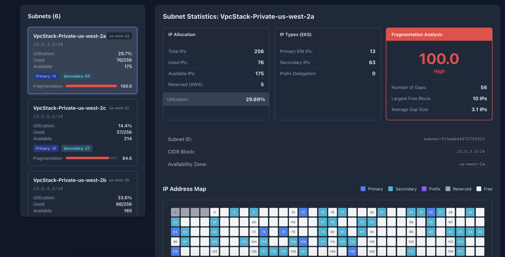

# VPC IP Fragmentation Viewer

A web application that visualizes IP address allocation and fragmentation in AWS VPCs, similar to disk defragmentation tools.

## Features

- **VPC & Subnet Overview**: View all VPCs and subnets with IP usage statistics
- **Fragmentation Analysis**: Calculate fragmentation scores based on IP allocation patterns
- **Visual IP Map**: Disk defrag-style visualization showing each IP address as a colored block
- **EKS Support**: Tracks primary IPs, secondary IPs, and prefix delegation IPs used by EKS pods
- **Real-time Data**: Fetches live data from AWS EC2 API

## Architecture

- **Backend**: Flask API that queries AWS EC2 APIs for VPC, subnet, and ENI information
- **Frontend**: React application with visual IP allocation grid
- **Deployment**: Containerized with Docker, ready for ECS/EKS deployment

## Prerequisites

- Python 3.11+
- Node.js 18+
- AWS credentials configured (via `~/.aws/credentials` or IAM role)
- Docker and Docker Compose (for containerized development)

## Quick Start

### Option 1: Local Development with Virtual Environment

1. **Set up Python environment**:
   ```bash
   ./setup.sh
   source venv/bin/activate
   ```

2. **Start the backend**:
   ```bash
   python app.py
   ```
   Backend will run on http://localhost:5000

3. **Start the frontend** (in a new terminal):
   ```bash
   cd frontend
   npm install
   npm start
   ```
   Frontend will run on http://localhost:3000

### Option 2: Docker Compose (Recommended for Local Testing)

1. **Create `.env` file**:
   ```bash
   cp .env.example .env
   ```

2. **Start all services**:
   ```bash
   docker-compose up
   ```

   This will start:
   - Backend API on http://localhost:5000
   - Frontend UI on http://localhost:3000

3. **Stop services**:
   ```bash
   docker-compose down
   ```

## API Endpoints

- `GET /api/health` - Health check
- `GET /api/vpcs` - List all VPCs
- `GET /api/vpc/<vpc_id>/subnets` - Get subnets for a VPC with statistics
- `GET /api/subnet/<subnet_id>/ips` - Get detailed IP allocation map for a subnet
- `GET /api/vpc/<vpc_id>/tags` - Discover tag keys across VPC resources
- `GET /api/vpc/<vpc_id>/tag-groups?tag_key=` - Get IP utilization grouped by tag values

## EKS IP Tracking

The application correctly handles EKS pod networking modes:

1. **Primary IPs**: IPs directly assigned to ENIs
2. **Secondary IPs**: Additional IPs on ENIs used by pods without dedicated ENIs
3. **Prefix Delegation**: IPs from /28 prefixes assigned to ENIs (EKS prefix mode)

All IP types are tracked and visualized in the fragmentation analysis.

## Fragmentation Score

The fragmentation score (0-100) indicates how scattered the IP allocations are:

- **0-20**: Low fragmentation (IPs mostly contiguous)
- **21-50**: Moderate fragmentation (some gaps)
- **51-100**: High fragmentation (many small gaps, difficult to allocate large blocks)

### Metrics Provided

- Number of gaps between used IPs
- Average gap size
- Largest contiguous free block
- Utilization percentage

## Deployment to ECS/EKS

### Build Production Image

```bash
docker build -t vpc-ip-viewer .
```

### Push to ECR

```bash
aws ecr get-login-password --region us-east-1 | docker login --username AWS --password-stdin <account-id>.dkr.ecr.us-east-1.amazonaws.com
docker tag vpc-ip-viewer:latest <account-id>.dkr.ecr.us-east-1.amazonaws.com/vpc-ip-viewer:latest
docker push <account-id>.dkr.ecr.us-east-1.amazonaws.com/vpc-ip-viewer:latest
```

### IAM Permissions Required

The application needs the following EC2 permissions:

```json
{
  "Version": "2012-10-17",
  "Statement": [
    {
      "Effect": "Allow",
      "Action": [
        "ec2:DescribeVpcs",
        "ec2:DescribeSubnets",
        "ec2:DescribeNetworkInterfaces",
        "ec2:DescribeInstances",
        "ec2:DescribeRegions",
        "ec2:GetSubnetCidrReservations"
      ],
      "Resource": "*"
    }
  ]
}
```

### EKS Deployment with IRSA

When deploying to EKS, use [IAM Roles for Service Accounts (IRSA)](https://docs.aws.amazon.com/eks/latest/userguide/iam-roles-for-service-accounts.html) to grant the pod AWS permissions without using node-level credentials.

**1. Associate an OIDC provider with your cluster** (one-time setup):

```bash
eksctl utils associate-iam-oidc-provider \
  --cluster <cluster-name> \
  --region <region> \
  --approve
```

**2. Create an IAM policy:**

```bash
aws iam create-policy \
  --policy-name FragmentationViewerPolicy \
  --policy-document '{
    "Version": "2012-10-17",
    "Statement": [
      {
        "Effect": "Allow",
        "Action": [
          "ec2:DescribeVpcs",
          "ec2:DescribeSubnets",
          "ec2:DescribeNetworkInterfaces",
          "ec2:DescribeInstances",
          "ec2:DescribeRegions",
          "ec2:GetSubnetCidrReservations"
        ],
        "Resource": "*"
      }
    ]
  }'
```

**3. Create a Kubernetes service account with the IAM role:**

```bash
eksctl create iamserviceaccount \
  --name fragmentation-viewer-sa \
  --namespace default \
  --cluster <cluster-name> \
  --region <region> \
  --attach-policy-arn arn:aws:iam::<account-id>:policy/FragmentationViewerPolicy \
  --approve
```

**4. Reference the service account in your deployment:**

```yaml
spec:
  template:
    spec:
      serviceAccountName: fragmentation-viewer-sa
      containers:
        - name: fragmentation-viewer
          image: <account-id>.dkr.ecr.<region>.amazonaws.com/vpc-ip-viewer:latest
```

Sample Kubernetes manifests are provided in the `k8s/` directory.

## Screenshot


## Development

### Project Structure

```
.
├── app.py                  # Flask backend
├── requirements.txt        # Python dependencies
├── Dockerfile              # Production container
├── Dockerfile.dev          # Development container
├── docker-compose.yml      # Local development setup
└── frontend/               # React frontend (to be created)
    ├── package.json
    ├── public/
    └── src/
```

## License

MIT-0 (see file headers for full license text)
